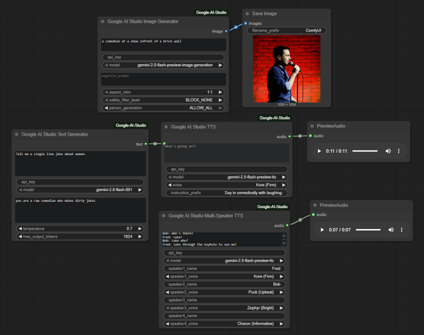

# ComfyUI Google AI Studio Nodes

This custom node package provides integration with Google AI Studio's latest APIs for ComfyUI, including Text-to-Speech (TTS), Text Generation, and Image Generation using the `google-genai` [Google Gen AI SDK](https://github.com/googleapis/python-genai) (Google AI Studio).



## Features

- **Text Generation**: Generate creative text, stories, essays using Gemini models
- **Image Generation**: Create stunning images using Google's Gemini (free) and Imagen (paid) models
- **Google AI Studio TTS**: Convert text to speech using Google's Gemini TTS models
- **Multi-Speaker TTS**: Generate conversations with multiple distinct voices
- **30+ Voice Options**: Choose from a wide variety of high-quality voices with style descriptions

## Installation

1. Clone this repository into your ComfyUI `custom_nodes` directory:
   ```bash
   cd ComfyUI/custom_nodes
   git clone https://github.com/BuffMcBigHuge/ComfyUI-Google-AI-Studio.git
   ```

2. Install the required dependencies:
   ```bash
   cd ComfyUI-Google-AI-Studio
   pip install -r requirements.txt
   ```

3. Get your Google AI Studio API key:
   - Visit [https://aistudio.google.com/](https://aistudio.google.com/)
   - Sign up or log in
   - Generate an API key
   - Keep this key secure

4. Restart ComfyUI

## Nodes


### Google AI Studio Text Generator

Generates text using Google's Gemini models for creative writing, essays, code, and more.

**Inputs:**
- `prompt`: The text prompt to generate from (multiline supported)
- `api_key`: Your Google AI Studio API key
- `model`: Choose from Gemini models (gemini-2.0-flash-001, gemini-1.5-pro, etc.)
- `system_instruction` (optional): Guide the model's behavior and tone
- `temperature` (optional): Controls creativity (0.0-2.0, default 0.7)
- `max_output_tokens` (optional): Maximum tokens to generate (1-8192, default 1024)

**Output:**
- `text`: Generated text content

### Google AI Studio Image Generator

Creates images using Google's Gemini and Imagen models from text descriptions.

**Available Models:**
- `gemini-2.0-flash-preview-image-generation` - **Free tier** (default, basic controls)
- `imagen-3.0-generate-002` - **Paid tier** (high quality, advanced controls)
- `imagen-3.0-fast-generate-001` - **Paid tier** (faster generation, advanced controls)

**Inputs:**
- `prompt`: Description of the image to generate
- `api_key`: Your Google AI Studio API key
- `model`: Choose from available models above
- `negative_prompt` (optional): What you don't want in the image *(works with all models)*
- `aspect_ratio` (optional): Image proportions *(⚠️ Imagen only - ignored for Gemini)*
- `safety_filter_level` (optional): Content filtering *(⚠️ Imagen only - ignored for Gemini)*
- `person_generation` (optional): People generation controls *(⚠️ Imagen only - ignored for Gemini)*

### Google AI Studio TTS

Converts text to speech using Google's Gemini TTS models.

**Inputs:**
- `text`: The text to convert to speech (multiline supported)
- `api_key`: Your Google AI Studio API key
- `model`: Choose between `gemini-2.5-flash-preview-tts` or `gemini-2.5-pro-preview-tts`
- `voice`: Select from 30+ available voices (Kore, Puck, Zephyr, etc.)
- `instruction_prefix` (optional): Add style instructions like "Say cheerfully:" or "Read slowly:"

**Output:**
- `audio`: Audio data compatible with ComfyUI audio nodes

### Google AI Studio Multi-Speaker TTS

Generates conversations with multiple distinct voices.

**Inputs:**
- `transcript`: Multi-line text with speaker names (format: "Speaker Name: dialogue")
- `api_key`: Your Google AI Studio API key  
- `model`: TTS model selection
- `speaker1_name` / `speaker1_voice`: First speaker configuration
- `speaker2_name` / `speaker2_voice`: Second speaker configuration
- `speaker3_name` / `speaker3_voice` (optional): Third speaker
- `speaker4_name` / `speaker4_voice` (optional): Fourth speaker

**Output:**
- `audio`: Multi-speaker audio data

**Model Capabilities:**

| Feature | Gemini Models (Free) | Imagen Models (Paid) |
|---------|---------------------|---------------------|
| Text-to-image | ✅ | ✅ |
| Negative prompts | ✅ (in main prompt) | ✅ (separate parameter) |
| Aspect ratio control | ❌ | ✅ |
| Safety filter levels | ❌ (built-in safety) | ✅ |
| Person generation control | ❌ | ✅ |

**Output:**
- `image`: Generated image compatible with ComfyUI image nodes

## Available Voices

The following 30 voices are available, each with distinct characteristics:

| Voice | Style | Voice | Style | Voice | Style |
|-------|--------|-------|--------|-------|--------|
| Zephyr | Bright | Puck | Upbeat | Charon | Informative |
| Kore | Firm | Fenrir | Excitable | Leda | Youthful |
| Orus | Firm | Aoede | Breezy | Callirrhoe | Easy-going |
| Autonoe | Bright | Enceladus | Breathy | Iapetus | Clear |
| Umbriel | Easy-going | Algieba | Smooth | Despina | Smooth |
| Erinome | Clear | Algenib | Gravelly | Rasalgethi | Informative |
| Laomedeia | Upbeat | Achernar | Soft | Alnilam | Firm |
| Schedar | Even | Gacrux | Mature | Pulcherrima | Forward |
| Achird | Friendly | Zubenelgenubi | Casual | Vindemiatrix | Gentle |
| Sadachbia | Lively | Sadaltager | Knowledgeable | Sulafat | Warm |

## Supported Languages

The TTS models automatically detect input language and support 24 languages including:
- English (US, India)
- Spanish (US)
- French (France)
- German (Germany)
- Italian (Italy)
- Portuguese (Brazil)
- Japanese (Japan)
- Korean (Korea)
- Chinese (Simplified, Traditional)
- Hindi (India)
- Arabic (Egyptian)
- Russian (Russia)
- And more...

## Usage Examples

### Text Generation Example
1. Add a "Google AI Studio Text Generator" node
2. Enter your prompt: `"Write a creative short story about a robot learning to paint"`
3. Enter your API key
4. Select model: `gemini-2.0-flash-001`
5. Adjust temperature for creativity (0.7 for balanced, 1.5 for very creative)
6. Connect output to text display or save node

### Image Generation Example
1. Add a "Google AI Studio Image Generator" node
2. Enter your prompt: `"A serene Japanese garden with cherry blossoms and a small pond"`
3. Enter your API key
4. Select model: `gemini-2.0-flash-preview-image-generation` (free tier, default)
5. For advanced controls (paid tier), switch to `imagen-3.0-generate-002` and adjust aspect ratio, safety settings
6. Connect output to image preview or save node

### Basic TTS Example
1. Add a "Google AI Studio TTS" node
2. Enter your text: `"Welcome to my podcast! Today we're discussing AI."`
3. Enter your API key
4. Select voice: `Kore`
5. Connect output to audio preview or save node

### Multi-Speaker Conversation Example
1. Add a "Google AI Studio Multi-Speaker TTS" node
2. Enter transcript:
   ```
   Host: Welcome to Tech Talk!
   Guest: Thanks for having me on the show.
   Host: Let's dive into today's topic.
   ```
3. Configure speakers:
   - Speaker 1: `Host` with voice `Kore`
   - Speaker 2: `Guest` with voice `Puck`
4. Connect output to audio nodes

### Style Control Example
Use the `instruction_prefix` to control speech style:
- `"Say cheerfully:"` - Upbeat delivery
- `"Read slowly and clearly:"` - Careful pronunciation
- `"Speak in a whisper:"` - Quiet, intimate tone
- `"Say with excitement:"` - Energetic delivery

## Technical Details

- **Audio Format**: 24kHz, 16-bit PCM, mono/stereo
- **Context Window**: 32k tokens maximum
- **Output Format**: ComfyUI-compatible audio tensors
- **API Rate Limits**: Subject to Google AI Studio quotas

## Troubleshooting

### Common Issues

1. **"Google AI SDK not installed"**
   - Run: `pip install google-genai`

2. **"API key is required"**
   - Get your key from [https://aistudio.google.com/](https://aistudio.google.com/)
   - Ensure the key is entered correctly

3. **"TTS generation failed"**
   - Check your internet connection
   - Verify API key is valid and has quota remaining
   - Ensure text is within the 32k token limit

4. **Audio playback issues**
   - Ensure ComfyUI audio nodes are properly connected
   - Check that audio preview nodes support the format

### API Limits
- Free tier: Limited requests per minute
- Check your usage at [Google AI Studio](https://aistudio.google.com/)

## Support

For issues specific to these nodes:
- Check the [Issues](https://github.com/BuffMcBigHuge/ComfyUI-Google-AI-Studio/issues) page
- Review the troubleshooting section above

For Google AI Studio API issues:
- Visit [Google AI Studio documentation](https://ai.google.dev/gemini-api/docs)
- Check the [Google AI Forum](https://discuss.ai.google.dev/)

## License

This project is licensed under the MIT License - see the LICENSE file for details.

---

**Note**: This is an unofficial community-created integration. Google AI Studio is a product of Google LLC. 